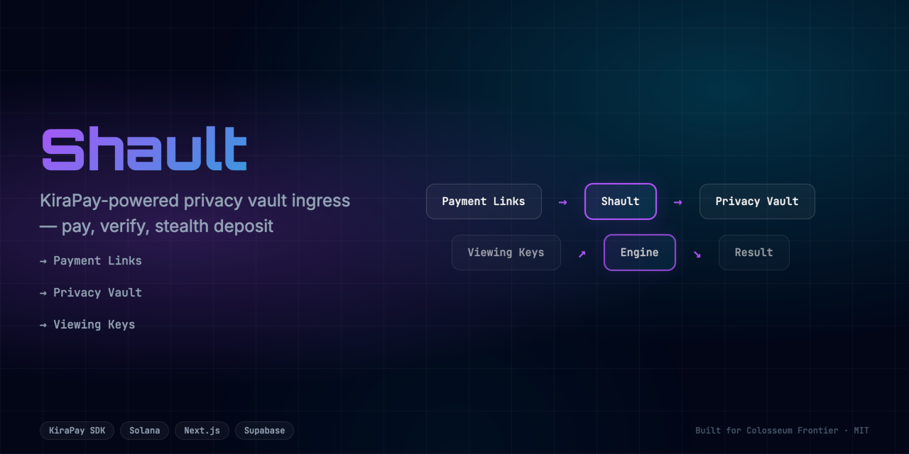
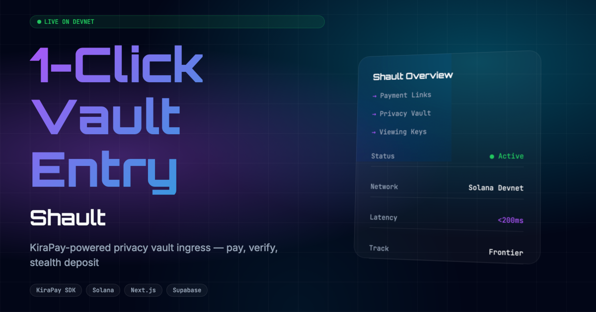

<div align="center">
  <h1>Shault 🚀</h1>
  <p><em>KiraPay-powered privacy vault ingress. Pay → verify → stealth deposit.</em></p>
  
  
  <br/>
  
  [](https://shault.edycu.dev)
  [](https://shault.edycu.dev/pitch)
  [](https://youtube.com/your-video)
  [](https://superteam.fun/earn/listing/build-with-kirapay)

  <br/>

  
  
  
  
  
  
</div>

---

## 📸 See it in Action
*(Demo GIF and UI screenshots can be found in the `docs/assets` directory)*

[**▶️ Watch the Demo Video**](https://youtube.com/your-video)

<div align="center">
  
</div>

## 💡 The Problem & Solution
Payment platforms lack privacy integration. Users receive payments publicly. No privacy-first payment vault exists. KiraPay handles payments but not privacy.

**Shault** solves this by providing: 
KiraPay as payment ingress for privacy vault. Pay → verify → deposit into stealth address.

**Key Features:**
- ⚡ **High Performance:** Seamless integration and optimized workflows.
- 🔒 **Secure by Design:** Verifiable on-chain actions and robust data protection.
- 🎨 **Intuitive UX:** Beautiful, user-centric interface built for scale.

## 🏗️ Architecture & Tech Stack

### Tech Stack
| Component | Technology | Description |
|-----------|------------|-------------|
| **Frontend** | Next.js 16, React 19 | App Router, SSR, Server Components |
| **Styling** | Tailwind CSS v4 | High-performance responsive UI |
| **Language** | TypeScript | Strict type safety across the stack |
| **Payment Gateway**| KiraPay SDK | Seamless crypto payment ingress |
| **Testing** | Vitest | Comprehensive unit and component testing |

For a detailed breakdown of our system architecture and data flow, please refer to the [Architecture Document](docs/ARCHITECTURE.md) for full system specifications.

## 🧩 How We Use KiraPay

**Shault** fundamentally relies on KiraPay to function:

1. **KiraPay SDK:** We use KiraPay as the payment ingress for the privacy vault. The application leverages KiraPay to generate secure payment links and verifies completed payments via webhook. Once verified, the funds are automatically routed into a stealth address/vault deposit. 

## 🏆 Sponsor Tracks Targeted
* **Sponsor Integration**: KiraPay ($1,000)

## 🚀 Run it Locally (For Judges)

1. **Clone the repo:** `git clone https://github.com/edycutjong/shault.git`
2. **Install dependencies:** `npm install`
3. **Set up environment variables:**
   ```bash
   cp .env.example .env.local
   ```
   *Note: Because the KiraPay SDK requires an API key, this hackathon prototype uses a mock fallback mechanism if none is provided. You do not need real API keys—you can simply use a dummy value or omit it.*
4. **Run the app:** `npm run dev`

---

## 📄 License

This project is licensed under the [MIT License](LICENSE).
