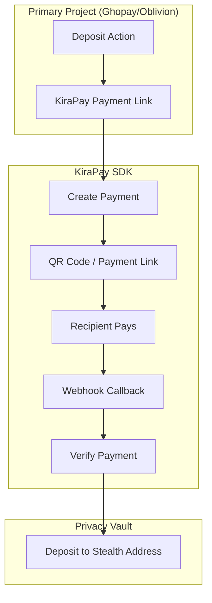

# Shault — Technical Architecture

## System Architecture

## KiraPay SDK Integration Map

| Feature | Use Case | Depth |
|---|---|---|
| **Create Payment** | Generate payment link with amount | 🟢 Core |
| **Payment Verification** | Verify payment completed | 🟢 Core |
| **Webhook Callback** | Trigger vault deposit on payment | 🟢 Core |

## API Routes

| Method | Path | Description |
|---|---|---|
| POST | `/api/payment/create` | Create KiraPay payment link |
| POST | `/api/payment/webhook` | KiraPay callback → trigger vault deposit |
| GET | `/api/payment/:id/status` | Check payment status |
